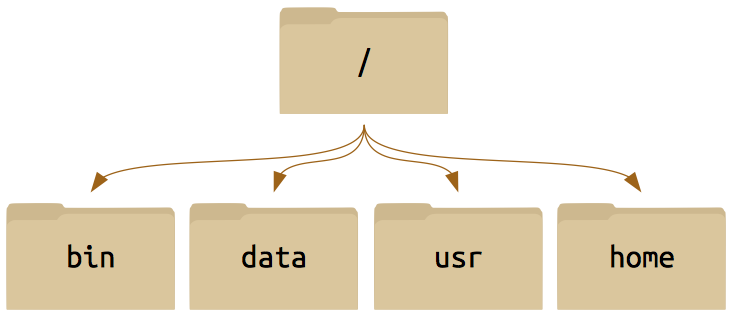
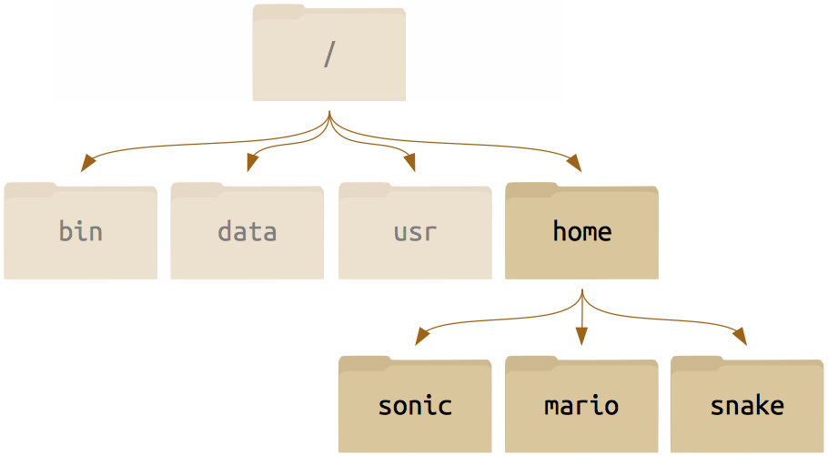
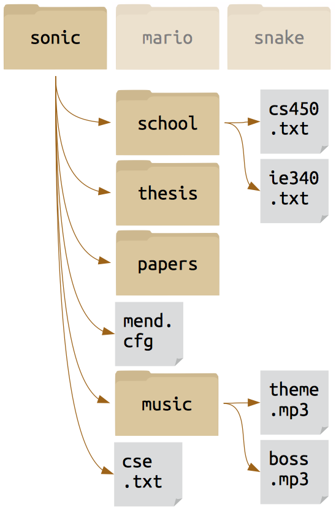

# Introduction to Bash (The Linux Command Line)

## Introduction
#### Objectives
-   Explain how the shell relates to the keyboard, the screen, the operating system, and users' programs.
-   Explain when and why command-line interfaces should be used instead of graphical interfaces.

#### Discussion
-   A shell is a program whose primary purpose is to read commands and run other programs.
-   The shell's main advantages are its high action-to-keystroke ratio, its support for automating repetitive tasks, and that it can be used to access networked machines.
-   The shell's main disadvantages are its primarily textual nature and how cryptic its commands and operation can be.

## Files & Directories
#### Objectives

-   Explain the similarities and differences between a file and a directory.
-   Translate an absolute path into a relative path and vice versa.
-   Construct absolute and relative paths that identify specific files and directories.
-   Explain the steps in the shell's read-run-print cycle.
-   Identify the actual command, flags, and filenames in a command-line call.
-   Demonstrate the use of tab completion, and explain its advantages.

#### Discussion

-   The file system is responsible for managing information on the disk.
-   Information is stored in files, which are stored in directories (folders).
-   Directories can also store other directories, which forms a directory tree.
-   `/` on its own is the root directory of the whole filesystem.
-   A relative path specifies a location starting from the current location.
-   An absolute path specifies a location from the root of the filesystem.
-   Directory names in a path are separated with `/` on Unix, but `\` on Windows.
-   `..` means "the directory above the current one"; `.` on its own means "the current directory".
-   Most files' names are `something.extension`. The extension isn't required, and doesn't guarantee anything, but is normally used to indicate the type of data in the file.
-   Most commands take options (flags) which begin with a `-`.

### Unix File System

* All of the directories are descended from the master **root** directory `/`.
* Each of the top-level directories descend directly from the **root** `/`. There are many other standard directories on Unix-derived systems: `/usr`, `/bin`, `/opt`, *etc.*)

 

---

 
####Within any one of these folders we can identify a subsidiary structure:

 

---

 
And then we can drill down all the way to something that perhaps looks more familiar to you, a home directory populated with files just like you may treat the **My Documents** folder on Windows.

###Do [Exercise #1](./ex1.html)

## Create files and folders
#### Objectives

-   Create a directory hierarchy that matches a given diagram.
-   Create files in that hierarchy using an editor or by copying and renaming existing files.
-   Display the contents of a directory using the command line.
-   Delete specified files and/or directories.

#### Discussion

-   Unix documentation uses `^A` to mean "control-A".
-   The shell does not have a trash bin: once something is deleted, it's really gone.
-   Nano is a very simple text editor—please use something else for real work.

###Do [Exercise #2](./ex2.html)

## Pipes & filters
#### Objectives
-   Redirect a command's output to a file.
-   Process a file instead of keyboard input using redirection.
-   Construct command pipelines with two or more stages.
-   Explain what usually happens if a program or pipeline isn't given any input to process.
-   Explain Unix's "small pieces, loosely joined" philosophy.

#### Discussion

-   `command > file` redirects a command's output to a file.
-   `first | second` is a pipeline: the output of the first command is used as the input to the second.
-   The best way to use the shell is to use pipes to combine simple single-purpose programs (filters).

###Do [Exercise #3](./ex3.html)

## Loops
#### Objectives
-   Write a loop that applies one or more commands separately to each file in a set of files.
-   Trace the values taken on by a loop variable during execution of the loop.
-   Explain the difference between a variable's name and its value.
-   Explain why spaces and some punctuation characters shouldn't be used in files' names.
-   Demonstrate how to see what commands have recently been executed.
-   Re-run recently executed commands without retyping them.

#### Discussion

-   A `for` loop repeats commands once for every thing in a list.
-   Every `for` loop needs a variable to refer to the current "thing".
-   Use `$name` to expand a variable (i.e., get its value).
-   Do not use spaces, quotes, or wildcard characters such as `*` or `?` in filenames, as it complicates variable expansion.
-   Give files consistent names that are easy to match with wildcard patterns to make it easy to select them for looping.
-   Use the up-arrow key to scroll up through previous commands to edit and repeat them.
-   Use `history` to display recent commands, and `!number` to repeat a command by number.

###Do [Exercise #4](./ex4.html)

## Shell Scripts
#### Objectives
-   Write a shell script that runs a command or series of commands for a fixed set of files.
-   Run a shell script from the command line.
-   Write a shell script that operates on a set of files defined by the user on the command line.
-   Create pipelines that include user-written shell scripts.

#### Discussion

-   Save commands in files (usually called shell scripts) for re-use.
-   `bash filename` runs the commands saved in a file.
-   `$*` refers to all of a shell script's command-line parameters.
-   `$1`, `$2`, etc., refer to specified command-line parameters.
-   Letting users decide what files to process is more flexible and more consistent with built-in Unix commands.

###Do [Exercise #5](./ex5.html)

## Finding Things
#### Objectives
-   Use `grep` to select lines from text files that match simple patterns.
-   Use `find` to find files whose names match simple patterns.
-   Use the output of one command as the command-line parameters to another command.
-   Explain what is meant by "text" and "binary" files, and why many common tools don't handle the latter well.

#### Discussion

-   Use find to find files and directories, and grep to find text patterns in files.
-   `$(command)` inserts a command's output in place.
-   man command displays the manual page for a given command.

###Do [Exercise #6](./ex6.html)

#Congratulations! Now you are a Linux-guru*!

*&nbsp; :)

