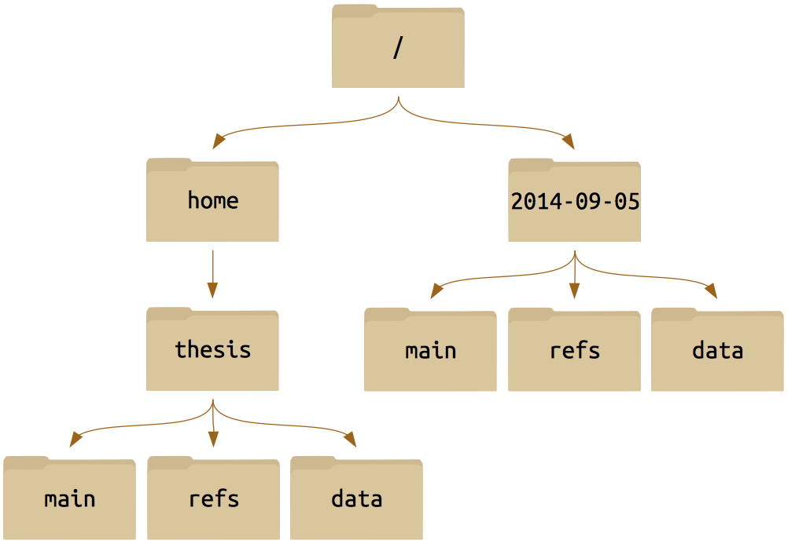

# Exercises. Part 1

###Consider the following directory structure

###Questions:
1. If pwd displays `/home/thesis`, what will `ls ../thesis` display?

1. If `pwd` displays `/home`, and `-r` tells `ls` to display things in **reverse** order, what command will display `refs/ main/ data/` ?

1. Similarly, if `pwd` displays `/thesis/main`, what command will display the same output as before?

1. What does the command `cd` without a directory name do?
