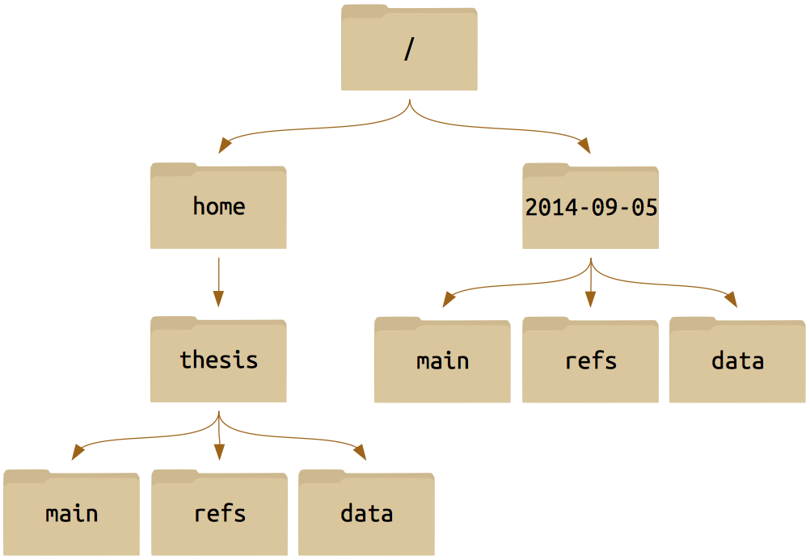

# Exercises. Part 2

###Consider the following directory structure



###Question:


- What is the output of the closing `ls` command in the sequence shown below?

```
$ pwd
/home/thesis/data

$ touch proteins.dat

$ ls
proteins.dat
    
$ mkdir recombine

$ mv proteins.dat recombine

$ cp recombine/proteins.dat ../proteins-saved.dat

$ ls
```

-   Suppose that:

```
$ ls -F
analyzed/  fructose.dat    raw/   sucrose.dat
```

    
- What command(s) (such as `rm`, `mv`) could you run so that the commands below will produce the output shown?

```
$ ls
analyzed   raw
    
$ ls analyzed
fructose.dat    sucrose.dat
```

- What does `cp` do when given several filenames and a directory name, as in:

```
$ mkdir backup
    
$ cp thesis/citations.txt thesis/quotations.txt backup
```
    
- What does `cp` do when given three or more filenames, as in:
    
```
$ ls -F    
intro.txt    methods.txt    survey.txt
    
$ cp intro.txt methods.txt survey.txt
```
    
- Why do you think `cp` behaves differently from `mv`?

-   The command `ls -R` lists the contents of directories recursively,
    _i.e._, lists their sub-directories, sub-sub-directories, and so on
    in alphabetical order at each level. The command `ls -t` lists things
    by time of last change, with most recently changed files or
    directories first. In what order does `ls -R -t` display things?


